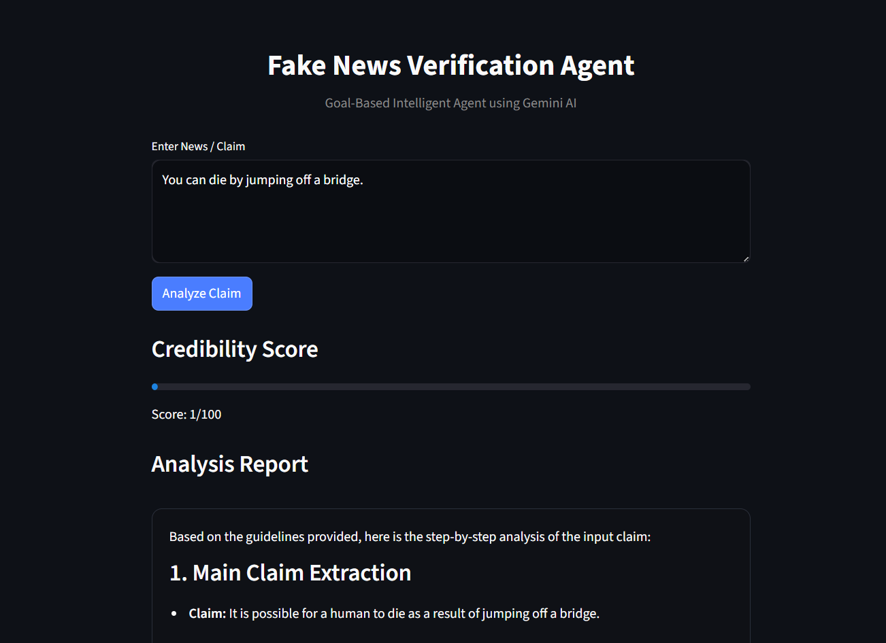
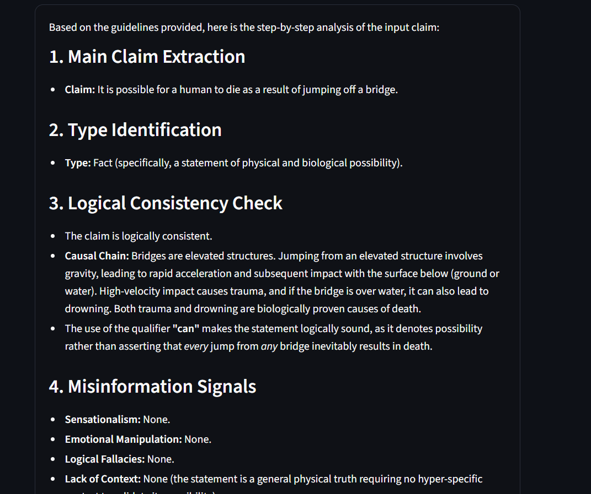

# Fake News Verification AI Agent (Gemini Powered)

An AI-based system that analyzes news claims and detects misinformation using Google Gemini. The project uses structured prompting to evaluate claims and generate a credibility score along with a final verdict.

## Features

- Accepts any news claim as input
- Uses Gemini AI for reasoning and analysis
- Classifies claims as fact, opinion, rumor, or exaggeration
- Detects misinformation signals
- Generates a credibility score (0–100)
- Provides final verdict: True, False, Misleading, or Unverified
- Extracts structured output from LLM response

## How It Works

User Input → Prompt Engineering → Gemini AI → Structured Analysis → Score Extraction → Final Verdict

## Tech Stack

- Python
- Google Gemini AI
- Regex for score extraction
- Prompt Engineering

## Output

The system returns:
- Claim analysis
- Credibility score
- Final verdict
- Reasoning explanation

## Purpose

To help identify fake or misleading news using AI-driven reasoning and improve digital information reliability.